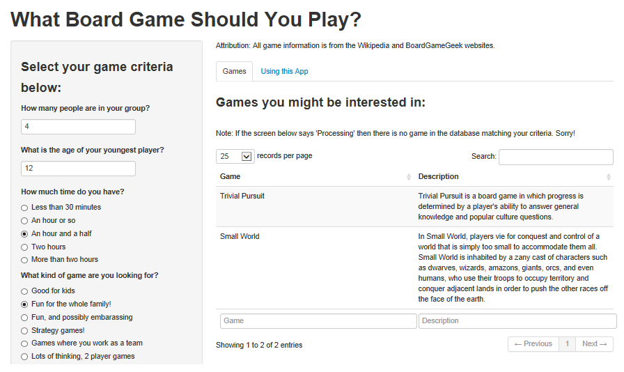

--- 
title       : What Board Game Should You Play?
subtitle    : An easy-to-use web App for those tough board game decisions.
author      : Jantina Toxopeus
job         : 
framework   : io2012        # {io2012, html5slides, shower, dzslides, ...}
highlighter : highlight.js  # {highlight.js, prettify, highlight}
hitheme     : tomorrow      # 
widgets     : []            # {mathjax, quiz, bootstrap}
mode        : selfcontained # {standalone, draft}
knit        : slidify::knit2slides

---

## Is this a familiar conundrum?

> - You and your friends/family want to play a game, but...  
> - You never know which game to choose, and ...
> - You always end up arguing and not having much fun at all.

  

[Image source](http://img3.wikia.nocookie.net/__cb20110622105630/uncyclopedia/images/7/7b/091123123740-arguing_couple.jpg)

---

## The solution: [this App!](https://jtoxopeu.shinyapps.io/boardgames/)

---

## Features of the App
### "What Board Game Should You Play?"

- Draws from a database of 34 games, many of which are highly ranked on game websites such as [BoardGameGeek](www.boardgamegeek.com).
- Contains games in 7 categories, including abstract thinking games, children's games, cooperative games, family games, strategy games, party games, and war-themed games.
- Generates a list of game names and descriptions based on four simple inputs:
    - The number of players,
    - The age of the youngest member of the group,
    - The time you want to play for, and
    - The type of game you'd like to play.

---

## The End Result: A Happy Games Night!

  

[Image source](http://blog.intelliquote.com/Portals/154849/images/familygenerations.jpg)

